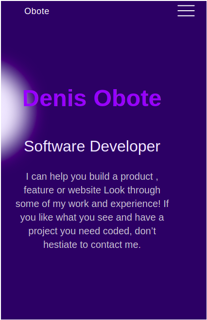

## My portfolio 

This project is a mobile version of my portfolio. it willbe contious project that will show what am capable of doing a developer.

## Built With

- node
- hmtl
- css

### Install
- Node dependencies

## Authors

👤 **Author1**

- GitHub: [@Obote](https://github.com/Obote)
- Twitter: [@Obote_denis](https://twitter.com/Obote_denis)
- LinkedIn: [Obote Denis](https://www.linkedin.com/in/obote-denis-9859a2a3/)

## 🤝 Contributing

Contributions, issues, and feature requests are welcome!

Feel free to check the [issues page](../../issues/).

## Show your support

Give a ⭐️ if you like this project!

## Acknowledgments

- Hat tip to anyone whose code was used
- Inspiration
- Microverse

## 📝 License

This project is [MIT](./MIT.md) licensed.
